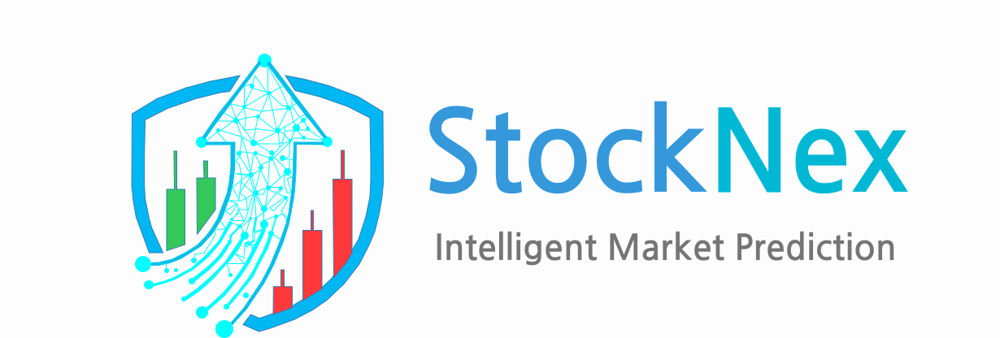

<p align="center">
  
</p>

<h1 align="center">StockNex – Adaptive Stock Market Prediction Platform</h1>

<p align="center">
  <strong>500+ Specialized LSTM Models • Real-Time Market Intelligence • Continuous Learning System</strong>
</p>

<p align="center">
  <!-- Frontend -->
  
  
  
  
  <br>
  <!-- Backend -->
  
  
  
  
  <br>
  <!-- ML & Data -->
  
  
  
  
  
  <br>
  <!-- Infrastructure -->
  
  
  
  <br>
  <!-- Data Science Stack -->
  
  
  
  <br>
  <!-- Visualization -->
  
  
  
</p>

<p align="center">
  <a href="#-the-innovation">Innovation</a> •
  <a href="#-key-features">Features</a> •
  <a href="#-quick-start">Quick Start</a> •
  <a href="#-documentation">Documentation Suite</a>
</p>

---

## 🎯 The Innovation

**StockNex redefines financial forecasting by rejecting the "one-model-fits-all" paradigm.**

Most prediction systems train a single model on thousands of stocks, forcing Apple, ExxonMobil, and Netflix to share the same neural architecture despite their fundamentally different trading behaviors.

**StockNex does the opposite.**

<p align="center">
  
  <br>
  <em>Each S&P 500 company receives its own dedicated LSTM network, optimized for its unique volatility profile</em>
</p>

### 🔬 Core Innovation Pillars

| Pillar | What It Means | Why It Matters |
|--------|---------------|----------------|
| **Model Specialization** | 500+ individual LSTM models, one per S&P 500 company | Captures company-specific seasonality, volatility patterns, and market reactions |
| **Continuous Learning** | Models are regularly retrained as new data arrives | Predictions evolve with market dynamics—no stale intelligence |
| **Bayesian Hyperparameter Discovery** | Optuna automatically finds optimal architecture for each stock | No manual tuning; each company gets its ideal lookback window, layer depth, and regularization |
| **Production ML Pipeline** | Dedicated FastAPI service with complete model lifecycle management | Training, inference, versioning, and retirement in one isolated service |
| **On-Demand Intelligence** | Users generate fresh forecasts from the latest models in real-time | No batch predictions; every request uses the most current model state |

> *"Apple trades differently than ExxonMobil. Netflix exhibits distinct volatility compared to Johnson & Johnson. StockNex respects these differences."*

---

## ✨ Key Features

### 📊 Real-Time Market Command Center
- **Live S&P 500 Dashboard** – Streaming prices with configurable refresh intervals
- **Sector Heatmap** – D3.js visualization of 500+ stocks, color-coded by performance
- **Intelligent Caching** – Multi-layer TTL strategy reduces API load by 80%
- **Curated News Feed** – Financial headlines with sentiment correlation

<p align="center">
  
  <br>
  <em>Complete market overview with indices, heatmap, and news</em>
</p>

### 🔮 AI Prediction Engine
- **On-Demand Forecasting** – Generate 1–30 day price predictions instantly
- **Confidence Intervals** – Statistical uncertainty visualization
- **Trend Analysis** – Bullish/bearish signals with probability scores
- **Full S&P 500 Coverage** – 500+ specialized models ready for inference

<p align="center">
  
  <br>
  <em>LSTM-generated forecast with confidence bands and trend indicators</em>
</p>

### 👤 User Experience
- **Secure Authentication** – JWT with automatic token refresh
- **Personal Watchlists** – Real-time price alerts, percentage change notifications
- **Prediction History** – Archive with performance tracking and accuracy metrics
- **Theme Customization** – Dark/light mode, avatar upload, session management

### 🛡️ Administrative Power
- **User Management** – Complete CRUD operations with bulk actions
- **Model Operations** – Train, evaluate, deploy, retire via admin interface
- **System Monitoring** – Real-time health metrics, error logs, cache statistics
- **Audit Trail** – Complete visibility into user activity and prediction views

<p align="center">
  
  <br>
  <em>Administrator dashboard with system metrics and model controls</em>
</p>

---

## 🚀 Quick Start

```bash
# 1. Clone and launch
git clone https://github.com/yourusername/stocknex.git
cd stocknex
docker-compose up -d

# 2. Create your admin account
./frontend/create-admin.sh -e admin@example.com -p "YourSecurePassword123!"

# 3. Open the app
open http://localhost:3000
```

**That's it.** The entire platform—frontend, backend, ML service, and database—is now running on your machine.

**[⬇️ Download Docker](https://docs.docker.com/get-docker/)** | **[📖 Full Installation Guide](DOCUMENTATION.md#-deployment)**

---

## 📸 Screenshots

<details>
<summary><strong>🖥️ Click to expand screenshot gallery</strong></summary>

<br>

| Dashboard | Stock Analysis |
|-----------|---------------|
|  |  |
| *Real-time S&P 500 overview* | *Historical data with technical indicators* |

| Prediction Interface | Watchlist |
|---------------------|-----------|
|  |  |
| *LSTM forecast with 15-day horizon* | *Personal stock tracking with alerts* |

| Admin Panel | Model Management |
|-------------|------------------|
|  |  |
| *User administration interface* | *Hyperparameter configuration interface* |

| Mobile View | Dark Mode |
|------------|-----------|
|  |  |
| *Responsive design* | *Theme customization* |

</details>

---

## 🧠 Why StockNex Exists

Financial markets are **not stationary**. Volatility regimes shift, sector correlations change, and individual companies evolve. Traditional prediction systems treat models as static artifacts—trained once, deployed forever, growing increasingly stale with each passing day.

**StockNex was built to solve this.**

| Problem | StockNex Solution |
|---------|-------------------|
| Generic models ignore company-specific behavior | 500+ specialized LSTM networks |
| Models become stale over time | Continuous retraining pipeline |
| Hyperparameter tuning requires manual expertise | Automated Bayesian optimization |
| ML infrastructure is complex to maintain | Isolated FastAPI service, containerized |
| Predictions are batch-generated, not on-demand | Real-time inference API |

The result is a **living prediction system** that adapts as markets adapt.

---

## 📚 Documentation Suite

| Document | Description |
|----------|-------------|
| **[📘 Technical Documentation](DOCUMENTATION.md)** | Complete architecture, API endpoints, database schema, deployment |
| **[🤖 ML Pipeline Documentation](STOCK-PREDICTION-API.md)** | LSTM architecture, Optuna tuning, model persistence, inference |
| **[🔐 Admin Guide](ADMIN-SETUP.md)** | Role configuration, security policies, maintenance |
| **[⚡ Create Admin Quickstart](CREATE-ADMIN-QUICKSTART.md)** | Fastest path to first admin user |

---

---

## 🤝 Contributing

We welcome contributions from the community. See our [Contributing Guide](CONTRIBUTING.md) to get started.

**Areas we need help with:**
- Additional ML models (Transformers, XGBoost ensembles)
- Frontend visualization components
- Performance optimization
- Documentation and translations

---

## 📄 License

MIT License — free for personal and commercial use.

---

<p align="center">
  <strong>Built with ❤️ for traders, quants, and market enthusiasts</strong>
  <br>
  <br>
  <a href="#-the-innovation">Innovation</a> •
  <a href="#-key-features">Features</a> •
  <a href="#-quick-start">Quick Start</a> •
  <a href="#-documentation">Documentation</a>
  <br>
  <br>
  <sub>Version 1.0.0 | Last Updated: February 2026</sub>
</p>

---
